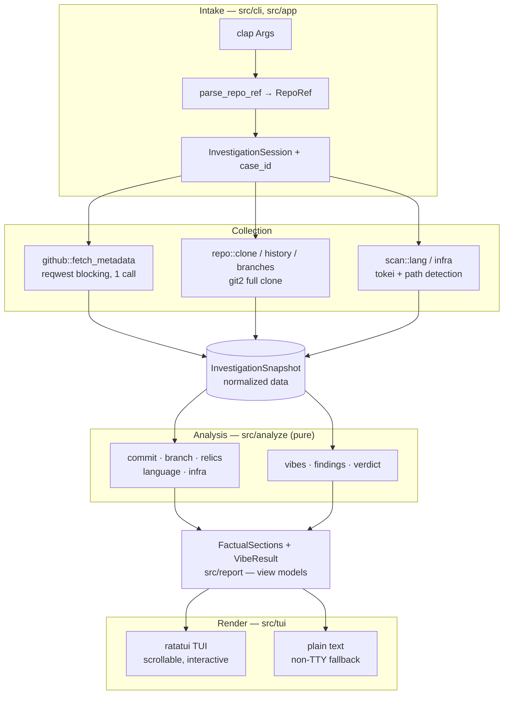
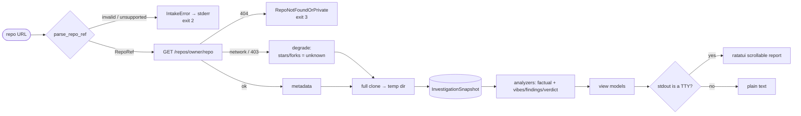
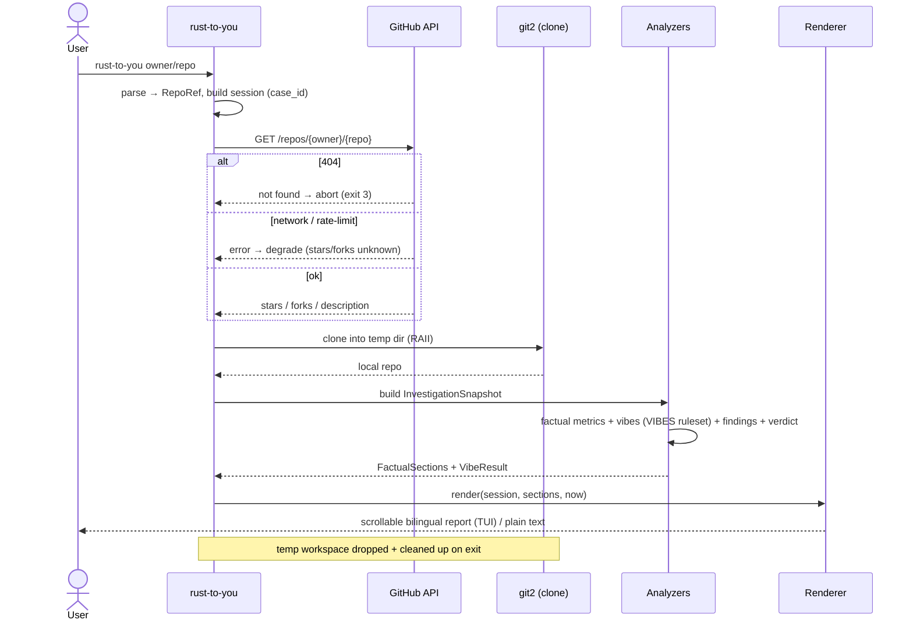

<div align="center">

# 🏗️ rust-to-you — Architecture

Technical documentation · README: [🇻🇳 Tiếng Việt](README.md) · [🇬🇧 English](README-en.md)

</div>

---

> The READMEs are Ferris talking to *you*. This document is the engineering side: how the tool is
> built, how data flows, and why the key decisions were made.

## 1. Overview

`rust-to-you` is a **single, synchronous pipeline** (no async runtime). One command in, one
report out:

```
URL  →  intake/validate  →  collect (API + clone)  →  normalize (snapshot)
     →  analyze (pure fns)  →  view models  →  render (TUI or plain text)
```

Design principles:
- **Read-only**, public GitHub repos only.
- **Git-first**: a full local clone (via `git2`) is the source of truth; the GitHub API is used
  for exactly one call (stars / forks / description).
- **Pure analyzers**: every metric is a pure function over a normalized `InvestigationSnapshot`,
  so it is deterministic and unit-testable with synthetic fixtures.
- **Snapshot is the carrier**: the cloned workspace is dropped after collection; everything
  downstream reads the snapshot only.
- **Bilingual by construction**: all user-facing text is VI + EN, narrated by Ferris.

## 2. Component architecture



| Layer | Modules | Responsibility |
|-------|---------|----------------|
| Intake | `cli/`, `app/` | Parse + validate the URL, build the session, choose TTY vs plain |
| Collection | `github/`, `repo/`, `scan/` | One API call + full clone + git/file facts |
| Data model | `snapshot.rs` | Normalize everything into `InvestigationSnapshot` |
| Analysis | `analyze/` | Pure functions → section metrics, vibes, findings, verdict |
| View models | `report/` | `FactualSections` (sections 1–6) + vibe/finding/verdict results |
| Render | `tui/` | ratatui report (or plain text); shared `i18n` + format helpers |
| Errors | `error.rs` | `IntakeError` taxonomy + tiered exit codes |

## 3. Investigation flow



**Bounded passes:** cheap aggregations (total commits, contributors, bus factor, repo age, branch
enumeration) walk the *full* history; expensive passes (most-modified file, time-of-day buckets)
are bounded to the **last 1000 commits** and labelled accordingly.

## 4. Runtime sequence



## 5. Repository Vibes — the classifier

Section 7 is a **weighted-scoring classifier** (`analyze/vibes.rs`):
- Each of the 7 vibes accumulates points from satisfied conditions over snapshot signals.
- Highest score wins; ties broken by specificity order; below `MIN_SCORE = 4` falls back to
  **Chaotic Good**.
- The satisfied conditions become the **evidence bullets** (grounded comedy — every label is
  justified).
- The runner-up vibe flows into Section 8 (Interesting Findings).

## 6. Module map

```text
src/
├── main.rs            # entrypoint: parse → session → run; maps errors to stderr + exit code
├── lib.rs             # module wiring (lib + bin crate)
├── error.rs           # IntakeError taxonomy + exit codes
├── i18n.rs            # Bilingual{vi,en} + two_line / inline_label
├── cli/               # clap Args + URL parsing → RepoRef
├── app/               # session, collect orchestration, run() seam
├── github/            # reqwest blocking client + RepoMetadata + classify(StatusCode)
├── repo/              # clone (tempfile RAII), history, branches (git2)
├── scan/              # tokei language breakdown + infra footprint detection
├── snapshot.rs        # InvestigationSnapshot (normalized data carrier)
├── analyze/           # pure analyzers: commit, branch, relics, language, infra, vibes, findings, verdict
├── report/            # FactualSections view models
└── tui/               # ratatui report, plain renderer, format helpers, scroll/keys (app.rs)
```

## 7. Key decisions

| Decision | Why |
|----------|-----|
| Full clone (not shallow) | Archaeology metrics need complete history; expensive passes are bounded instead |
| API limited to one call | Git supplies everything else → rate limits are a non-issue |
| No `tokio` (sync) | A single sequential call needs no async runtime |
| `reqwest` blocking + `rustls-tls` | Avoids an async stack; portable TLS |
| `git2` with `vendored-openssl` | Self-contained HTTPS clone without relying on system OpenSSL |
| `tokei` for languages | De-facto standard line counter |
| Pure analyzers over a snapshot | Deterministic, fixture-testable; enables a future `--json` |
| Bilingual `i18n` helper shared by TUI + plain | One source of truth for VI+EN text |
| Bus factor = fewest authors making ≥50% of commits | Cheap (commit-count), honest, bot/merge-filtered, identity-normalized |

## 8. Testing

- **Unit / fixture tests** (`cargo test`): URL parser table, git analyzers against in-memory
  fixture repos, GitHub status→error mapping, format helpers, vibe/finding/verdict rules, and a
  ratatui `TestBackend` smoke test for the report.
- **Manual**: the interactive TUI (scroll/keys, resize) and live clones against real repos.

---

<div align="center">

Back to: [🇻🇳 README (Tiếng Việt)](README.md) · [🇬🇧 README (English)](README-en.md)

</div>
