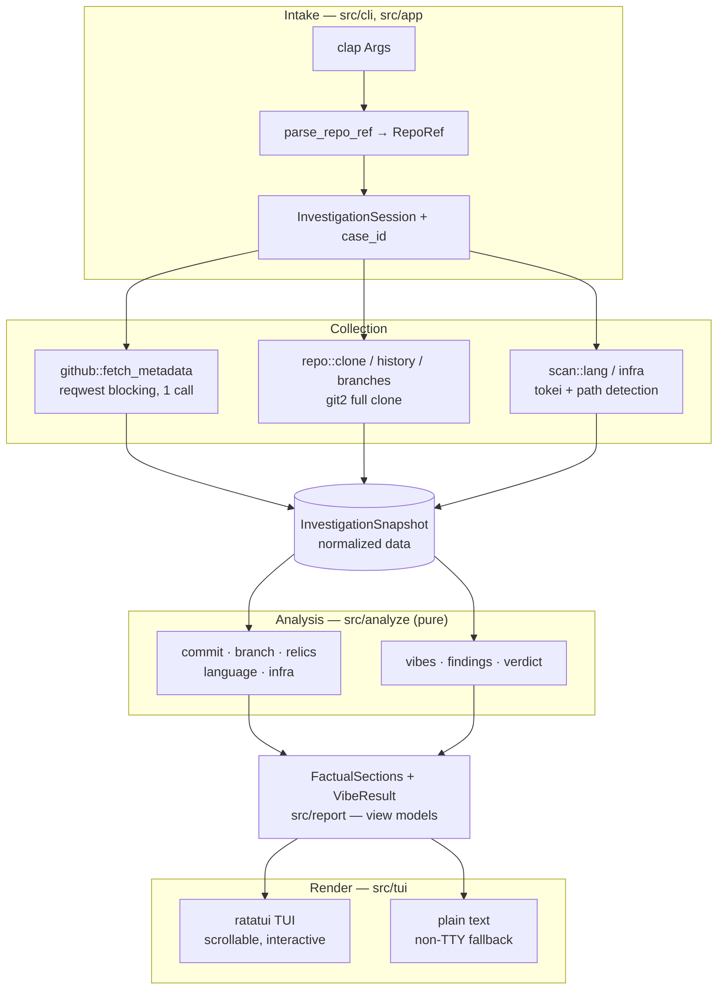
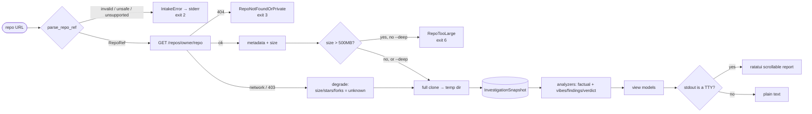

<div align="center">

# 🏗️ rust-to-you — Architecture

Technical documentation · README: [🇻🇳 Tiếng Việt](README.md) · [🇬🇧 English](README-en.md)

</div>

---

> The READMEs are Ferris talking to *you*. This document is the engineering side: how the tool is
> built, how data flows, and why the key decisions were made.

## 1. Overview

`rust-to-you` is a **single, synchronous pipeline** (no async runtime). One command in, one
report out:

```
URL  →  intake/validate  →  collect (API + size-guard + clone)  →  normalize (snapshot)
     →  analyze (pure fns)  →  view models  →  render (TUI or plain text)
```

Design principles:
- **Read-only**, public GitHub repos only.
- **Git-first**: a full local clone (via `git2`) is the source of truth; the GitHub API is used
  for exactly one call (stars / forks / description / **size**).
- **Pure analyzers**: every metric is a pure function over a normalized `InvestigationSnapshot`,
  so it is deterministic and unit-testable with synthetic fixtures.
- **Snapshot is the carrier**: the cloned workspace is dropped after collection; everything
  downstream reads the snapshot only.
- **Safe & self-cleaning intake**: oversized repos are refused *before* cloning (500 MB
  pre-flight guard via the API `size` field, `--deep` to override); unsafe input (leading `-`,
  over-length segments, traversal) is rejected at the parser before any network or git call; and
  the temp clone is cleaned up on **every** exit path — normal, Ctrl-C/SIGTERM, or panic — with a
  startup sweep for any strays left by a previous crash. See [docs/THREAT-MODEL.md](docs/THREAT-MODEL.md).
- **Bilingual by construction**: all user-facing text is VI + EN, narrated by Ferris.

## 2. Component architecture



| Layer | Modules | Responsibility |
|-------|---------|----------------|
| Intake | `cli/`, `app/` | Parse + validate the URL, build the session, choose TTY vs plain |
| Collection | `github/`, `repo/`, `scan/` | One API call + full clone + git/file facts |
| Data model | `snapshot.rs` | Normalize everything into `InvestigationSnapshot` |
| Analysis | `analyze/` | Pure functions → section metrics, vibes, findings, verdict |
| View models | `report/` | `FactualSections` (sections 1–6) + vibe/finding/verdict results |
| Render | `tui/` | ratatui report (or plain text); shared `i18n` + format helpers |
| Errors | `error.rs` | `IntakeError` taxonomy + tiered exit codes |

## 3. Investigation flow



**Bounded passes:** cheap aggregations (total commits, contributors, bus factor, repo age, branch
enumeration) walk the *full* history; expensive passes (most-modified file, time-of-day buckets)
are bounded to the **last 1000 commits** and labelled accordingly.

## 4. Runtime sequence

```mermaid
sequenceDiagram
    actor User
    participant CLI as rust-to-you
    participant GH as GitHub API
    participant Git as git2 (clone)
    participant An as Analyzers
    participant R as Renderer

    User->>CLI: rust-to-you owner/repo
    CLI->>CLI: parse → RepoRef, build session (case_id)
    CLI->>GH: GET /repos/{owner}/{repo}
    alt 404
        GH-->>CLI: not found → abort (exit 3)
    else network / rate-limit
        GH-->>CLI: error → degrade (stars/forks unknown)
    else ok
        GH-->>CLI: stars / forks / description / size
    end
    CLI->>CLI: size > 500MB and no --deep? → RepoTooLarge (exit 6), never clone
    CLI->>Git: clone into temp dir (RAII + live-temp registry)
    Git-->>CLI: local repo
    CLI->>An: build InvestigationSnapshot
    An->>An: factual metrics + vibes (VIBES ruleset) + findings + verdict
    An-->>CLI: FactualSections + VibeResult
    CLI->>R: render(session, sections, now)
    R-->>User: scrollable bilingual report (TUI) / plain text
    Note over CLI,Git: temp workspace cleaned up on every exit — normal Drop,<br/>SIGINT/SIGTERM handler (exit 130), or panic hook; idempotent
```

## 5. Repository Vibes — the classifier

Section 7 is a **weighted-scoring classifier** (`analyze/vibes.rs`):
- Each of the 7 vibes accumulates points from satisfied conditions over snapshot signals.
- Highest score wins; ties broken by specificity order; below `MIN_SCORE = 4` falls back to
  **Chaotic Good**.
- The satisfied conditions become the **evidence bullets** (grounded comedy — every label is
  justified).
- The runner-up vibe flows into Section 8 (Interesting Findings).

## 6. Module map

```text
src/
├── main.rs            # entrypoint: install signal handler + panic hook + startup temp sweep, then parse → session → run
├── lib.rs             # module wiring (lib + bin crate)
├── error.rs           # IntakeError taxonomy + exit codes (2 input/unsafe · 3 not-found · 4 net · 5 collect · 6 too-large)
├── i18n.rs            # Bilingual{vi,en} + two_line / inline_label
├── cli/               # clap Args (incl. --deep) + URL parsing → RepoRef (rejects leading-dash / over-length)
├── app/               # session (carries deep), collect orchestration (pre-flight size guard), run() seam
├── github/            # reqwest blocking client + RepoMetadata (incl. size) + classify(StatusCode)
├── repo/              # clone (tempfile RAII), hygiene (signal/panic cleanup + orphan sweep), history, branches (git2)
├── scan/              # tokei language breakdown + infra footprint detection
├── snapshot.rs        # InvestigationSnapshot (normalized data carrier)
├── analyze/           # pure analyzers: commit, branch, relics, language, infra, vibes, findings, verdict
├── report/            # FactualSections view models
└── tui/               # ratatui report, plain renderer, format helpers, scroll/keys (app.rs)
```

## 7. Key decisions

| Decision | Why |
|----------|-----|
| Full clone (not shallow) | Archaeology metrics need complete history; expensive passes are bounded instead |
| Refuse-by-default size guard (500 MB) + `--deep` | A full clone of a giant repo can hang the machine; refuse pre-flight using the API `size` field, with an explicit opt-in. Hardcoded threshold keeps the surface minimal |
| Intake hardening at the parser | `git2` is libgit2 FFI (no shell), so the surface is narrow by construction; the parser still rejects leading-dash arg-injection, over-length and traversal *before* any network/git call |
| Cleanup on every exit path + startup sweep | `std::process::exit` skips `Drop`, so a `ctrlc` handler + panic hook clean the live temp (tracked in a global registry); a 60-min age-based startup sweep self-heals strays from prior crashes |
| API limited to one call | Git supplies everything else → rate limits are a non-issue |
| No `tokio` (sync) | A single sequential call needs no async runtime |
| `reqwest` blocking + `rustls-tls` | Avoids an async stack; portable TLS |
| `git2` with `vendored-openssl` | Self-contained HTTPS clone without relying on system OpenSSL |
| `tokei` for languages | De-facto standard line counter |
| Pure analyzers over a snapshot | Deterministic, fixture-testable; enables a future `--json` |
| Bilingual `i18n` helper shared by TUI + plain | One source of truth for VI+EN text |
| Bus factor = fewest authors making ≥50% of commits | Cheap (commit-count), honest, bot/merge-filtered, identity-normalized |

## 8. Testing

- **Unit / fixture tests** (`cargo test`): URL parser table (incl. unsafe-input reject cases), the
  pure `size_decision` guard, error exit-code + bilingual-message assertions, temp hygiene
  (age-based `sweep_orphans` over fixtures + idempotent cleanup + panic-hook cleanup), git
  analyzers against in-memory fixture repos, GitHub status→error mapping, format helpers,
  vibe/finding/verdict rules, and a ratatui `TestBackend` smoke test for the report.
- **Integration** (`cargo test --test interrupt -- --ignored`): spawns the binary, interrupts an
  in-progress clone with SIGINT/SIGTERM, and asserts no orphaned temp dir remains and the process
  exits 130. Network-gated, hence `#[ignore]` by default.
- **Manual**: the interactive TUI (scroll/keys, resize) and live clones against real repos.

---

<div align="center">

Back to: [🇻🇳 README (Tiếng Việt)](README.md) · [🇬🇧 README (English)](README-en.md)

</div>
